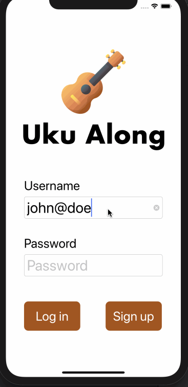

# Original App Design Project - README Template

# Uku Along

## Table of Contents

1. [Overview](#Overview)
1. [Product Spec](#Product-Spec)
1. [Wireframes](#Wireframes)
1. [Schema](#Schema)

## Overview

### Description

Uku Along is an app in which users can create ukulele chords of their original songs or to cover existing songs and record themselves while playing the songs with a ukulele. Users can also favor songs that they like, saving them in their own accounts for future reference. Users can also make friends and chat with them in the community of Uku Along.

### App Evaluation

[Evaluation of our app across the following attributes]

- **Category:** Social Networking / Music
- **Mobile:** This app would be primarily developed for mobile but would perhaps be just as viable on a tablet, such as spotify or other similar apps. Functionality wouldn't be limited to mobile devices, however mobile version could potentially have more features.
- **Story:** The user can view the chords data posted by other users. The users can record themselves. The user can also comment/chat on other users.
- **Market:** Any individual could choose to use this app.
- **Habit:** This app could be used as often as the user wants to learn or practice the chords of songs.
- **Scope:** First we start with the original or the cover songs produced by the users and they can input the chords of the songs, then this could evolve into a music-tabs sharing community application as well to broaden its usage. Large potential for use with spotify, apple music, or other music streaming applications.

## Product Spec

### 1. User Stories (Required and Optional)

**Required Must-have Stories**

- [x] User can sign up, sign in, stay signed in
- [x] User can create a song that they want to cover
  - The title of the song
  - The artist
  - The chords
- [ ] User can search the songs that they want to learn
- [x] User can record him/herself while playing along
- [ ] User can comment on other users' covers
- [ ] User can see other people's comment
- [ ] User can chat with other users

**Optional Nice-to-have Stories**

- User can see the lyrics
- User can leave notes for him/herself (only visible to the user)

### 2. Screen Archetypes

- Login screen
  - Allow user to input username and password
- Home screen
  - A search bar for user to search songs
    - All the covers of the songs
  - Feeds of the songs that have been recently uploaded and recorded
- Song screen
  - Detail of the songs (chords and lyrics)
  - A record button for users if they want to record themselves
    - toggle (red/grey), the user gets notified by the recording button
  - User can go back to Home screen
- Profile screen (for the user)
  - User can see the history of the songs he/she posted
    - can go to Song screen to view the details of the songs
  - User can see the history of the songs he/she bookmarked
    - can go to Song screen to view the details of the songs
  - User can see the history of the songs he/she recorded
    - present modally a screen that contains the recording
- Chat screen
  - The user can do a one-on-one chat or a group chat with other users
- Chords screen
  - The guide of all the ukulele chords (pictures)

### 3. Navigation

**Tab Navigation** (Tab to Screen)

- Home
- Profile
- Chords

**Flow Navigation** (Screen to Screen)

- Login/Sign-in screen
  - Home screen
- Home screen
  - Song screen
  - Profile screen
  - Chat screen
  - Chords screen
  - Logout
    - Login/Sign-in screen
- Song screen
  - Home screen
- Profile screen
  - Song screen
  - Home screen
  - Chat screen
  - Chords screen
- Chat screen
  - Home screen
- Chords screen
  - Home screen
  - Profile screen
  - Chat screen

## Wireframes

- The hand sketched wireframes - basic outline with tab bar controller
  

- The hand sketched wireframes - with details of the flow, displayed infomation and user interaction
  

### [BONUS] Digital Wireframes & Mockups


### [BONUS] Interactive Prototype


## Schema

### Models

User
| Property | Type |Description |
| :---: | :---: | :---: |
| userId | Number(?String?, hash) | unique ID for each user |
| username | String | the name of the user |
| password | String | the password of the user |
| profilePhoto | Image | the profile photo of the user |
| level | String | level of the user based on the number of the posts and the likes they receive |
| posts | Array (of the cover model) | covers created by the user |
| favorites | Array (of the cover model) | covers favored by the user |
| recordings | Array (of the recording model) | the recordings by the user |

Cover
| Property | Type |Description |
| :---: | :---: | :---: |
| coverId | Number | unique ID for each cover |
| coverCreator | String | name of the cover creator (basically username) |
| songTitle | String | the title of the covered song |
| songArtist | String | the artist of the covered song |
| coverContent | String | the content of the covered song with chords and lyrics|
| recordings (aac) | Array (of the recording model) | the recordings of that cover by different users |
| peopleWhoFavoredThePost | Array (of the user model) | the users who favored this cover |

Recording (grid display like Flix app)
| Property | Type |Description |
| :---: | :---: | :---: |
| userId | Number | unique ID for each user |
| coverId | Number | unique ID for each cover |
| video | ?? | the video content of the recording |

Chat (refer to Yelpy)
| Property | Type |Description |
| :---: | :---: | :---: |
| coverId | Number | unique ID for each cover |

Heart Button (just a variable to control it. eg: isFave)

- For the functionality of the heart button, I think we implement like this: If the user clicks the white heart, and the cover is added to the user's favorites array. If the user clicks the red heart, and the cover is removed from the user's favorites array.
- For the showing of the heart button, I think we just have a boolean (isFave) to control it's color. We need to check if a certain cover is inside the array of the current user's favorites array. If yes (then isFave == true), then the heart is red. If no (then isFave == false), the heart is white.

#### Unsolved questions:

- Array type?? in Swift?? [[]] NSDictionary!
- Ideas for the chat:
  - First step: get the global chat working
  - If more time, develop group chat based on the genre (users can join freely) (we hardcoded the groups)
  - Discuss (group chat, users can create their own groups)
  - Direct (one-to-one tutorial Mrugesh shared)

### Networking (using Firebase)

#### A list of network requests by screen:

- Home Feed Screen
  - (Read/GET) Query all covers from our database
  ```swift
  listener = query.addSnapshotListener { [unowned self] (snapshot, error) in
      guard let snapshot = snapshot else {
        print("Error fetching snapshot results: \(error!)")
        return
      }
      let covers = snapshot.documents.map { (document) -> Cover in
        let maybeCover: Cover?
        do {
          maybeCover = try document.data(as: Cover.self)
        } catch {
          fatalError("Unable to initialize type \(Cover.self) with dictionary \(document.data()): \(error)")
        }
        if let cover = maybeCover {
          return cover
        } else {
          // Don't use fatalError here in a real app.
          fatalError("Missing document of type \(Cover.self) at \(document.reference.path)")
        }
      }
  ```
  - (Create/POST) Create a new like on a cover
  - (Delete) Unlike a cover
- Chords Screen
  - (Read/GET) Query all chords from an existing API (Uberchord)
- Profile Screen

  - (Read/GET) Query all the info of the user from our database
  - (Delete) Delete a recording

  ```swift
  ref.runTransactionBlock({ (currentData: MutableData) -> TransactionResult in
  if var user = currentData.value as? [String : AnyObject], let uid = Auth.auth().currentUser?.uid {
    var recordings: Dictionary<String, Bool>
    recordings = user["recordingArray"] as? [String : Bool] ?? [:]
    var recordingCount = user["recordingCount"] as? Int ?? 0
    if let _ = recordings[uid] {
      // Unstar the post and remove self from stars
      recordingCount -= 1
      recordings.removeValue(forKey: uid)
    } else {
      // Star the post and add self to stars
      recordingCount += 1
      recordings[uid] = true
    }
    user["recordingCount"] = recordingCount as AnyObject?
    user["recordings"] = recordings as AnyObject?

    // Set value and report transaction success
    currentData.value = user

    return TransactionResult.success(withValue: currentData)
  }
  return TransactionResult.success(withValue: currentData)
  }) { (error, committed, snapshot) in
  if let error = error {
    print(error.localizedDescription)
  }
  }
  ```

- Edit Profile Screen
  - (Update/PUT) Update user profile info
  ```swift
  guard let key = ref.child("user").childByAutoId().key else { return }
  let user = ["userId": userID,
            "username": username]
  let userUpdates = ["/users/\(userID)/\(key)": user]
  ref.updateChildValues(userUpdates)
  ```
- Create Song Chords Screen
  - (Read/GET) Query the lyrics of the song based on the song title that user input from existing API
  - (Create/POST) Create a new cover
  ```swift
  ref.child("covers").child(cover.coverId).setValue(["content": content]) {
    (error:Error?, ref:DatabaseReference) in
    if let error = error {
      print("Data could not be saved: \(error).")
    } else {
      print("Data saved successfully!")
    }
  }
  ```
- Song Screen
  - (Read/GET) Query the info of the cover from our database (cover model)
  ```swift
  listener = query.addSnapshotListener { [unowned self] (snapshot, error) in
      guard let snapshot = snapshot else {
        print("Error fetching snapshot results: \(error!)")
        return
      }
      let covers = snapshot.documents.map { (document) -> Cover in
        let maybeCover: Cover?
        do {
          maybeCover = try document.data(as: Cover.self)
        } catch {
          fatalError("Unable to initialize type \(Cover.self) with dictionary \(document.data()): \(error)")
        }
        if let cover = maybeCover {
          return cover
        } else {
          // Don't use fatalError here in a real app.
          fatalError("Missing document of type \(Cover.self) at \(document.reference.path)")
        }
      }
  ```
- (Create/POST) Create a new like on a cover
- (Delete) Unlike a cover
- (Create/POST) Create a new recording of the user/cover
- Recordings Screen (a grid of all recordings)
  - (Read/GET) Query all the recordings of a certain cover from our database (recording model)
- Recording is playing Screen (a single recording)
  - (Read/GET) Query the video content data of the selected recording from our database (recording model)
- Chat Screen
  - (Read/GET) Query all the messages from our database
  - (Create/POST) Create a message

#### Basic snippets for each Firebase network request: (see snippets in the section above)

### [OPTIONAL:] Existing API Endpoints

- Uberchord API (read more carefully into that, and test if it can work)
- songsterr API (songs info) (use when user create a cover, song's info)
- Spotify API (use when user create a cover, song's info)

## Sprint 1
- Build progress GIF


## Sprint 2
- Build progress GIF

